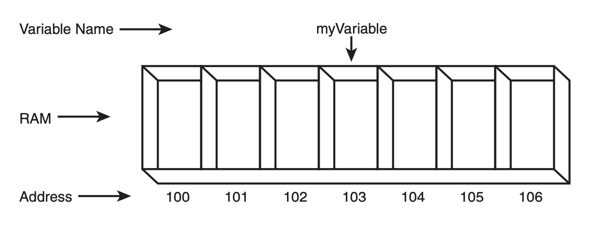

# Teach Yourself C++
# Introduction
- C++ fully supports object-oriented programming, including:
    - encapsulation: property off being a self-contained unit (allow of data hiding: one can use a method/class without understanding it fully). C++ supports encapsulation through the creation of user-defined types, classes.
    - inheritance: creation of subclasses that derive from existing types.
    - polymorphism: different objects can be treated similarly and still do the right thing through what is called function polymorphism and class polymorphism.


## Creating an Executable File
- C++ programs are typically created by linking one or more object files (`.obj` or `.o`) with a library.
- A library is a collection of linkable files that were supplied with the compiler.

The steps to create an executable file:
1. create a source code file with `.cpp` extension.
2. compile the source code into an object file with the `.obj` or `.o` extension.
3. link thee object file with any needed libraries to produce an executable program.

## First File
```cpp
#include <iostream>

int main() {
    std::cout << "Hello, World!" << std::endl;
    return 0;
}
```

- `#include <iostream>`:
    - `#` works as a signal to a program called the preprocessor. The preprocessor reads through the source code, looking for lines that being with the pound symbol.
    - `#include` is a preprocessor instruction that says "what follows is a file name".
    - `iostream` is used by `cout`, which assists with writing to the console.
- `main()` every C++ program has a `main()` function.
- `return 0` indicates that the file executed correctly.
- `cout` to print a value to the screen, we use `cout`.

## Cout
- `<<` is called the insertion operator.
- `std::cout << “Here is 5: “ << 5 << “\n”` prints three values
- `std:endl` has the purpose of writing a new line in the console, with the alternative of `\n`.
- `\t` inserts a tab character

## Using Standard Namespace
To avoid printing `std` everytime, you can use:
```cpp
// Listing 2.3 - using the using keyword
#include <iostream>
int main()
{
    using std::cout; // Note this declaration
    using std::endl;

    cout << “Hello there.\n”;
    cout << “Here is 5: “ << 5 << “\n”;
    cout << “The manipulator endl “;
    cout << “writes a new line to the screen.”;
    cout << endl;
    cout << “Here is a very big number:\t” << 70000;
    cout << endl;
    cout << “Here is the sum of 8 and 5:\t”;
    cout << 8+5 << endl;
    cout << “Here’s a fraction:\t\t”;
    cout << (float) 5/8 << endl;
    cout << “And a very very big number:\t”;
    cout << (double) 7000 * 7000 << endl;
    cout << “Don’t forget to replace Jesse Liberty “;
    cout << “with your name...\n”;
    cout << “Jesse Liberty is a C++ programmer!\n”;
    return 0;
}
```
This is achiavable with `using` and specifying that we are using these function from `std`.

Another alternative is to use namesace keyword:

```cpp
// Listing 2.4 - using namespace std
#include <iostream>
int main()
{
    using namespace std; // Note this declaration
    cout << “Hello there.\n”;
    cout << “Here is 5: “ << 5 << “\n”;
    cout << “The manipulator endl “;
    cout << “writes a new line to the screen.”;
    cout << endl;
    cout << “Here is a very big number:\t” << 70000;
    cout << endl;
    cout << “Here is the sum of 8 and 5:\t”;
    cout << 8+5 << endl;
    cout << “Here’s a fraction:\t\t”;
    cout << (float) 5/8 << endl;
    cout << “And a very very big number:\t”;
    cout << (double) 7000 * 7000 << endl;
    cout << “Don’t forget to replace Jesse Liberty “;
    cout << “with your name...\n”;
    cout << “Jesse Liberty is a C++ programmer!\n”;
    return 0;
}
```

The advantage of using the `namespace std` is that we do not need to specify the specific objects that we are using. Nonetheless, you can run into the problem of using objects from other libraries.

## Functions - <<sum.cpp>>
Including functions to the program:

```cpp
#include <iostream>

// function Demonstration Function
// prints out a useful message
void DemonstrationFunction()
{
    std::cout << “In Demonstration Function\n”;
}

// function main - prints out a message, then
// calls DemonstrationFunction, then prints out
// a second message.
int main()
{
    std::cout << “In main\n” ;
    DemonstrationFunction();
    std::cout << “Back in main\n”;
    return 0;
}
```

Output:
```
In main
In Demonstration Function
Back in main
```

- functions can either return a value or return `void`, meaning that they do not return anything
- functions consist of header and body
- if you do not put a return statement inside the function, it automatically returns `void`

Header of a function:
```cpp
int Sum( int first, int second)
```

Body of a function:
```cpp
{
    std::cout << Sum() received “<< first << “ and “<< second <<
    “\n”;
    return (first + second);
}
```
- the `std::cin` object is used in the same way as input

# Using Variables, Declaring Constants
- A variable is a place to store information.
- The variables are used for temporary storage, when you exit a program or turn the computer off, the information in variables is lost.
- A variable reserves one or more memory addresses.



- RAM stands for random access memory. When programmes talk about memory they are generally referrig to RAM.


