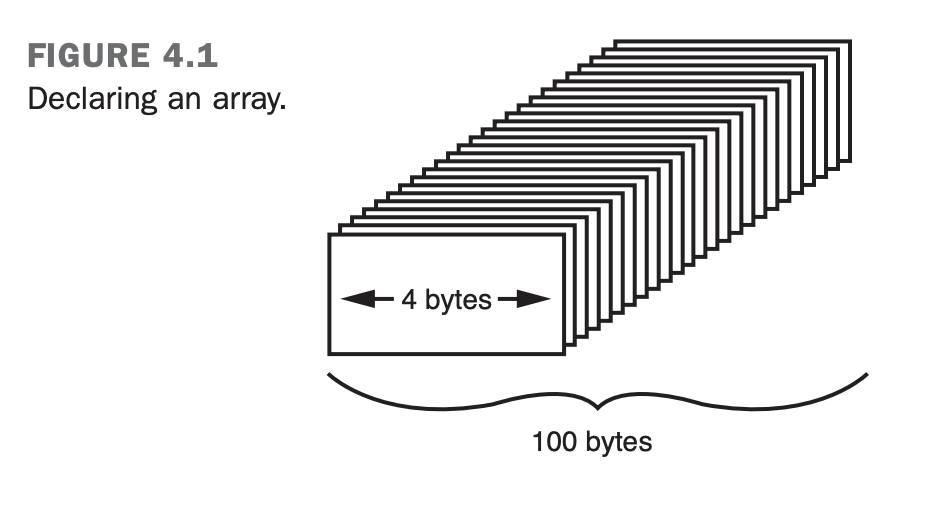
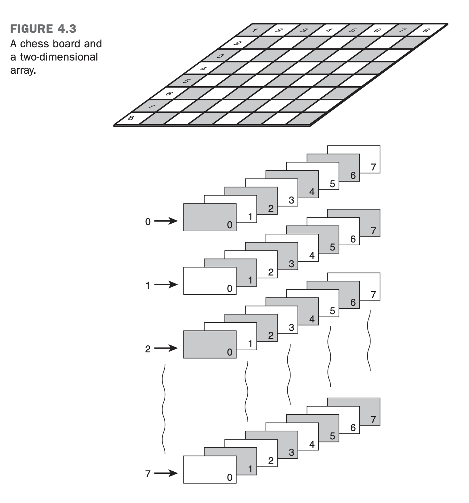

# Teach Yourself C++
# Introduction
- C++ fully supports object-oriented programming, including:
    - encapsulation: property off being a self-contained unit (allow of data hiding: one can use a method/class without understanding it fully). C++ supports encapsulation through the creation of user-defined types, classes.
    - inheritance: creation of subclasses that derive from existing types.
    - polymorphism: different objects can be treated similarly and still do the right thing through what is called function polymorphism and class polymorphism.


## Creating an Executable File
- C++ programs are typically created by linking one or more object files (`.obj` or `.o`) with a library.
- A library is a collection of linkable files that were supplied with the compiler.

The steps to create an executable file:
1. create a source code file with `.cpp` extension.
2. compile the source code into an object file with the `.obj` or `.o` extension.
3. link thee object file with any needed libraries to produce an executable program.

## First File
```cpp
#include <iostream>

int main() {
    std::cout << "Hello, World!" << std::endl;
    return 0;
}
```

- `#include <iostream>`:
    - `#` works as a signal to a program called the preprocessor. The preprocessor reads through the source code, looking for lines that being with the pound symbol.
    - `#include` is a preprocessor instruction that says "what follows is a file name".
    - `iostream` is used by `cout`, which assists with writing to the console.
- `main()` every C++ program has a `main()` function.
- `return 0` indicates that the file executed correctly.
- `cout` to print a value to the screen, we use `cout`.

## Cout
- `<<` is called the insertion operator.
- `std::cout << "Here is 5: " << 5 << "\n"` prints three values
- `std:endl` has the purpose of writing a new line in the console, with the alternative of `\n`.
- `\t` inserts a tab character

## Using Standard Namespace
To avoid printing `std` everytime, you can use:
```cpp
// Listing 2.3 - using the using keyword
#include <iostream>
int main()
{
    using std::cout; // Note this declaration
    using std::endl;

    cout << "Hello there.\n";
    cout << "Here is 5: " << 5 << "\n";
    cout << "The manipulator endl ";
    cout << "writes a new line to the screen.";
    cout << endl;
    cout << "Here is a very big number:\t" << 70000;
    cout << endl;
    cout << "Here is the sum of 8 and 5:\t";
    cout << 8+5 << endl;
    cout << "Here's a fraction:\t\t";
    cout << (float) 5/8 << endl;
    cout << "And a very very big number:\t";
    cout << (double) 7000 * 7000 << endl;
    cout << "Don't forget to replace Jesse Liberty ";
    cout << "with your name...\n";
    cout << "Jesse Liberty is a C++ programmer!\n";
    return 0;
}
```
This is achiavable with `using` and specifying that we are using these function from `std`.

Another alternative is to use namesace keyword:

```cpp
// Listing 2.4 - using namespace std
#include <iostream>
int main()
{
    using namespace std; // Note this declaration
    cout << "Hello there.\n";
    cout << "Here is 5: " << 5 << "\n";
    cout << "The manipulator endl ";
    cout << "writes a new line to the screen.";
    cout << endl;
    cout << "Here is a very big number:\t" << 70000;
    cout << endl;
    cout << "Here is the sum of 8 and 5:\t";
    cout << 8+5 << endl;
    cout << "Here's a fraction:\t\t";
    cout << (float) 5/8 << endl;
    cout << "And a very very big number:\t";
    cout << (double) 7000 * 7000 << endl;
    cout << "Don't forget to replace Jesse Liberty ";
    cout << "with your name...\n";
    cout << "Jesse Liberty is a C++ programmer!\n";
    return 0;
}
```

The advantage of using the `namespace std` is that we do not need to specify the specific objects that we are using. Nonetheless, you can run into the problem of using objects from other libraries.

## Functions - <<sum.cpp>>
Including functions to the program:

```cpp
#include <iostream>

// function Demonstration Function
// prints out a useful message
void DemonstrationFunction()
{
    std::cout << "In Demonstration Function\n";
}

// function main - prints out a message, then
// calls DemonstrationFunction, then prints out
// a second message.
int main()
{
    std::cout << "In main\n" ;
    DemonstrationFunction();
    std::cout << "Back in main\n";
    return 0;
}
```

Output:
```
In main
In Demonstration Function
Back in main
```

- functions can either return a value or return `void`, meaning that they do not return anything
- functions consist of header and body
- if you do not put a return statement inside the function, it automatically returns `void`

Header of a function:
```cpp
int Sum( int first, int second)
```

Body of a function:
```cpp
{
    std::cout << Sum() received "<< first << " and "<< second <<
    "\n";
    return (first + second);
}
```
- the `std::cin` object is used in the same way as input

# Using Variables, Declaring Constants
- A variable is a place to store information.
- The variables are used for temporary storage, when you exit a program or turn the computer off, the information in variables is lost.
- A variable reserves one or more memory addresses.


- RAM stands for random access memory. When programmes talk about memory they are generally referrig to RAM.
- When defining a variable it is necessary to specify the variable type: integer, floating-point number, character, etc...
- The information tells the compiler how much room to set aside for the value.

Each cubbyhole in memory is one byte in size. If the type of variable has for bytes in size, we need four cubbyholes.

## Variables types - <<variables.cpp>>
### Integer
- `short` integer is 2 bytes
- `long` integer is 4 bytes
- integers can be `signed` or `unsigned`: any integer without the word unsigned is assumed to be `signed`.

Both `signed` and `unsigned` are stored in the same amount of space.
The largest number that you can store in an `unsigned` integer is twice as big as the largest number you can store in an `signed` integer.

### Maximum
- maximum value for `unsigned short`: 65535
- maximum value for `signed short`: 32767 (also negative)
- maximum value for `unsigned long`: 4294967295
- maximum value for `signed long`: 214483647 (also negative)
- maximum value for `float`: `1.2e–38` to `3.4e38`
- maximum value for `char`: 255 character values
- maximum value for `double`: `2.2e–308` to `1.8e308`

## Name Convention
- C++ is case sensitive.
- for variables many programmers use lowercase: `my_car`
- alternatively, people use camel case: `myCar`

Another notation is the Hungarian notation: prefix every variable with a set of characters that describe its type.
- integers with `i`
- floats with `f`
- doubles with `d`
- etc...

Some keywords cannot be used as variable names (e.g. `const`, `int`, `if`, `while`, `for`, `return`, `void`, `main`).

## Memory Consumption
Some compilers can consume different amounts of memory for specific types of variables.

A good way to check the comsumption is with `sizeof` operator:
```cpp
#include <iostream>

int main()
{
  using std::cout;
  
  cout << "The size of an int is:\t\t" << sizeof(int) << " bytes.\n";
  cout << "The size of a short int is:\t" << sizeof(short) << " bytes.\n";
  cout << "The size of a long int is:\t" << sizeof(long) << " bytes.\n";
  cout << "The size of a char is:\t\t" << sizeof(char) << " bytes.\n";
  cout << "The size of a float is:\t\t" << sizeof(float) << " bytes.\n";
  cout << "The size of a double is:\t" << sizeof(double) << " bytes.\n";
  cout << "The size of a bool is:\t"  << sizeof(bool) << " bytes.\n";
  
  return 0;
}
```
You can create more than one variable in the same line:

```cpp
unsigned short int age, weight; // two unsigned short integers
long int area, width, length; // three long integers
```

Defining and assigning in the same line is also possible:

```cpp
long width = 5, length = 7;
```

## Creating Alias
`typedef` is used to create an alias for a type:
```cpp
typedef unsigned short int USHORT;
USHORT width = 5;
```

## When to Use `short` and `long`
If there is any chance the value will be larger than 65535, use `long`.
If you need a value larger than 4,294,967,295, use `float` or `double`.

## Characters
`char` variables are only of 1 byte, enough to hold 256 values.
It can be:
- a small number from 0 to 255
- a character from the ASCII table

A character is actually stored in memory as a number.

```cpp
#include <iostream>
int main() {
  for (int i = 32; i<128; i++)
  std::cout << (char) i;
  return 0;
}
```

Output:
```angular2html
!"#$%&'()*+,-./0123456789:;<=>?@ABCDEFGHIJKLMNOPQRSTUVWXYZ[\]^_`abcdefghijklmno
pqrstuvwxyz{|}~?
```

There are some special characters that are recognized as characters but have size bigger than:
- \a Bell (alert)
- \b Backspace
- \f Form feed
- \n New line
- \r Carriage return
- \t Tab
- \v Vertical tab
- \' Single quote
- \" Double quote
- \? Question mark
- \\ Backslash
- \000 Octal notation
- \xhhh Hexadecimal notation

## Constants
Constants are variables that do not change their value.
You must initialize the constant when you create it.

C++ has two ways to define constants: literal and symbolic.

### Literal Constants
A literal constant is a value typed directly into your program wherever it is needed. For example:
```cpp
int age = 39;
```

### Symbolic Constants
A symbol constant is a constant that is represented by a name.

### Define vs Const
`#define` is a preprocessor directive that tells the compiler to replace one string with another.
It is current obsolete and should be replaced by `const`.

```cpp
#define PI 3.14159
```

`const` is a keyword that tells the compiler that the value of the variable cannot be changed.
```cpp
const double PI = 3.14159;
```

## Enumerated Constants
Enumerated constants enable you to create new types and then define variables of those types.

```cpp
enum DAYS {Sunday, Monday, Tuesday, Wednesday, Thursday, Friday, Saturday};
```

- This statement makes DAYS the name of the enumeration; that is, a new type.
- It makes each of the days a symbolic constant with the value of 0, 1, 2, 3, 4, 5, and 6 (Sunday is 0, Monday is 1, etc.).

Every enumerated constant has an integer value, starting with 0. You can also define the value wanted for the enumerated constant.

```cpp
enum DAYS {Sunday = 1, Monday, Tuesday, Wednesday, Thursday, Friday, Saturday};
```

Or:

```cpp
enum DAYS {Sunday = 100, Monday = 50, Tuesday = 70, Wednesday = 40, Thursday = 60, Friday = 30, Saturday = 20};
```

The type of the enumerated constant is generally `unsigned int`.

A value of the type of the `enum` can be assigned to a variable of the type of the `enum`.

```cpp
DAYS payDay;

payDay = Friday;
```

# Array and Strings
- An Array is a sequential collectino of data storage locations.
- Each location has the same name and type.
- Each storage location is called an element of the array.

- You declare an array by writing the type, followed by the array name and subscript.
- The subscript is the number of elements in the array.

```cpp
int numbers[10];
```

- The first element of the array is `numbers[0]`.
- If you have an array of 10 elements, the last element is `numbers[9]`.

- If you have an array with 25 ints, the declaration sets aside 100 contiguous bytes of memory.



We can assign arrays in the following format:

```cpp
#include <iostream>

int main() {
    int miles[5] = {15, 20, 25, 30, 35};
    int i;
    for ( i=0; i<5; i++ ) {
        std::cout << "Element " << i << " = " << miles[i] << std::endl;
        std::cout << "Enter a new value for " << i << ": ";
        std::cin >> miles[i];
    }
    for ( i=0; i<5; i++ ) {
        std::cout << "Element " << i << " = " << miles[i] << std::endl;
    }
    return 0;
}
```

## Writing Past the End of an Array
When you write a value to an element in a array, the compiler computes where to store the value based on the size of the array.

Most compilers, if your code asks tot write in a position that is after the length of the array, will just ignore that the array is smaller than that and write regardless wherever you need.

Writing the value outside of the array space can have unpredictable results.

"the compiler is like a blind man pacing off thhe distance from a house"

```cpp
#include <iostream>
using namespace std;

int main() {
    long TargetArray[25];
    for (int i = 0; i < 25; i++){
        TargetArray[i] = 5;
    }
    cout << "Test 1:\n" << endl;
    cout << "TargetArray[0] = " << TargetArray[0] << endl;
    cout << "TargetArray[24] = " << TargetArray[24] << endl;
    cout << "\nTest 2:\n" << endl;
    cout << "Attempting to assign values beyond the upper bound:" << endl;
    for (int i = 25; i < 35; i++) {
        TargetArray[i] = 10; // may fail to compile
    }
    cout << "TargetArray[0] = " << TargetArray[0] << endl;
    cout << "TargetArray[24] = " << TargetArray[24] << endl;
    cout << "TargetArray[25] = " << TargetArray[25] << endl;
    cout << "TargetArray[30] = " << TargetArray[30] << endl;
}
```

This is called "buffer over-flow" error and the program is not guaranteed to work.

## Initializing Arrays
You can initialize an array when you declare it for built-in types: for instance, integers and characters.

Some ways to initialize the array:

### 1. Initialize the array with a specific size
```cpp
int IntegerArray[5];
```
The values in the array are just random variables.

### 2. Initialize the array with a specific size and one value
```cpp
int IntegerArray[5] = {0};
```
Every value in the array is set to zero.

### 3. Initialize the array with a specific size and multiple values
```cpp
int IntegerArray[5] = {1, 2, 3, 4, 5};
```
Every element is explicitly initialized.

### 4. Initialize the array with multiple values but no size
```cpp
int IntegerArray[] = {1, 2, 3, 4, 5};
```
The size of the array is automatically set to the number of elements in the list.

### 5, Initialize the array with the size and some of the values
```cpp
int IntegerArray[5] = {1, 2};
```
The first two elements are set to 1 and 2, the rest are set to 0.

## Combiningg the Array with Enum
```cpp
#include <iostream>
int main()
{
  enum WeekDays { Sun, Mon, Tue, Wed, Thu, Fri, Sat, DaysInWeek };
  int ArrayWeek[DaysInWeek] = { 10, 20, 30, 40, 50, 60, 70 };
  
  std::cout << "The value at Tuesday is: " << ArrayWeek[Tue];
  return 0;
}
```

```
The value at Tuesday is: 30
```

We create an enumerate and in position 7 we put the value DaysofWeek.
After, we create an Array with the size 7 (which is the enumerate of DaysInWeek) and we assign values to the array.
Then, it is easy to get the equivalent value of each day of the week: Tue is the third value in the enumerate, which is equivalent to 30.

## Multi-Dimensional Arrays
Each dimensino in an array is represented as a subscript in the array declaration.

A two-dimensional array has two subscripts.

The declaration of an array that represent as chess board:
```cpp
int ChessBoard[8][8];
```



Thing about that in a allocation perspective.
The first 8 elements go into the first array, the next 8 in the second array, and so forth...

```cpp  
int grades[3][4] = {1, 2, 3, 4, 5, 6, 7, 8, 9, 10, 11, 12};
```
Which is equivalent to:
```cpp
int grades[3][4] = {
  {1, 2, 3, 4},
  {5, 6, 7, 8},
  {9, 10, 11, 12}
};
```
In this case, the compiler ignores the braces, but they make it easier for us to understand how the numbers are distributed.

```cpp
#include <iostream>
using namespace std;

int main()
{
    int SomeArray[2][5] = { {0,1,2,3,4}, {0,2,4,6,8}};
    for (int i = 0; i<2; i++)
    {
        for (int j=0; j<5; j++)
        {
            cout << "SomeArray[" << i << "][" << j << "]: ";
            cout << SomeArray[i][j]<< endl;
        }
    }
    return 0;
}
```

## char Arrays and Strings
A string is an array of characters.

C-style string: array of characters that is terminated by a null character.

```cpp
cout << "hellow world" << endl;
```

We can declare C-style strings in the same way we would declare a numeric array:
```cpp
char Greeting[] = {'H', 'e', 'l', 'l', 'o', ' ', 'W', 'o', 'r', 'l', 'd', '\0'};
```

The character `\0` is the null character, which is used to terminate the string.

C++ enables us to work with a shorthand notation for strings:
```cpp
char Greeting[] = "Hello World";
```

- Instead of single-quoted characters separated by commas and surrounded by braces, you have a double-quoted C-style string, no commas, and no braces.
- You don't need to add the null character because the compiler adds it for you.

Hello World is 12 bytes:
- 5 bytes for Hello
- 1 byte for the space
- 5 bytes for World
- 1 byte for the null character

We can also create a non-initialized string:
```cpp
char Greeting[80];
```

This array has enough memory to hold 79 characters and a null character.

In the following code:
```cpp
//Listing 4.5 char array buffers

#include <iostream>

int main()
{
  char buffer[80] = {'\0'};
  std::cout << "Enter the string: ";
  std::cin >> buffer;
  std::cout << "Here's the buffer: " << buffer << std::endl;
  return 0;
}
```

```
Enter the string: Hello World
Here's the buffer: Hello
```
Two problems happen:
- the buffer cannot hold strings longer than 79 characters
- if the user enters a space, `cin` thinks that it is the end of the string, and it stops writing the buffer

For that, we must call a special method `get()` which takes three parameters:
- the buffer to fill
- the maximum number of characters to get
- the delimiter that terminates the input

```cpp
//Listing 4.6 using cin.get()

#include <iostream>
using namespace std;

int main()
{
  char buffer[80] = {'\0'};
  cout << "Enter the string: ";
  cin.get(buffer, 79); // get up to 79 or newline
  cout << "Here's the buffer: " << buffer << endl;
  return 0;
}
```

```
Enter the string: Hello World
Here's the buffer: Hello World
```

In this case, entering a 79 character also results in the end of the input.

## Using the `strcpy()` and `strncpy()` Method
Useful for copying one string into another.
```cpp
//Listing 4.7 Using strcpy()

#include <iostream>
#include <string.h>
using namespace std;

int main()
{
  char String1[] = "No man is an island";
  char String2[80] = {'\0'};
  
  strcpy(String2,String1);
  
  cout << "String1: " << String1 << endl;
  cout << "String2: " << String2 << endl;
  return 0;
}
```
A problem may arise if the source is larger than the destination: it will overwrite past the end of the buffer.

To avoid this, use `strncpy()`: it takes a maximum number to copy.
```cpp
//Listing 4.8 Using strncpy()

#include <iostream>
#include <string.h>

int main()
{
  const int MaxLength = 80;
  char String1[] = "No man is an island";
  char String2[MaxLength+1] = {'\0'};
  
  strncpy(String2, String1, MaxLength); // safer than strcpy
  
  std::cout << "String1: " << String1 << std::endl;
  std::cout << "String2: " << String2 << std::endl;
  return 0;
}
```

## String Class
The `string` class is a part of the `std` namespace.
This class handles memory allocation details and makes the copying strings or assigning them an easy activity.

```cpp
 #include <string>
 #include <iostream>

 int main ()
 {
  // A sample string
  std::string str1 ("This is a C++ string! ");
  
  // display on the console / screenstd::cout << "str1 = " << str1 << std::endl;
  std::cout << "str1 = " << str1 << std::endl;

  // a second sample string
  std::string str2;
  
  // assign to make a copy of the first in the second
  str2 = str1;
  
  // display the copy
  std::cout << "Result of assignment, str2 = " << str2 << std::endl;
  
  // change (overwrite) the second string with a new value
  str2 = "Hello string!";
  
  std::cout << "After over-writing contents, str2 = " << str2;
  std::cout << std::endl << std::endl;
  
  std::string strAddResult;
  
  // Add the two std::strings (concatenate) and store in a third
  strAddResult = str1 + str2;
  
  std::cout << "The result of str1 + str2 is = " << strAddResult;
  
  return 0;
}
```

```
str1 = This is a C++ string!
Result of assignment, str2 = This is a C++ string!
After over-writing contents, str2 = Hello string!
The result of str1 + str2 is = This is a C++ string! Hello string!
```

There are multiple methods for the string class which can be viewed in "The STL string Class".

# Working with Expressions, Statements and Operators
All C++ statements end with a semicolon and nothing else.

## Whitespace
Whitespace are the invisible characters such as tabs, spaces, and newlines.

## Operators
In C++ two types of operators exist:
- assignment operators (=)
- mathematical operators:
  - the common ones
  - % (modulus: tells the remainder of a division)

## Subtraction Troubles
Subtraction with unsigned integers can lead to problems.
If the result of the subtraction is negative, there is a overflow and the result is not what you expect.

## Dividing Integers
If you divide two integers and assign the result to another integer, the result will be an integer regardless of the decimal:
```cpp
5 / 2 = 2
```


